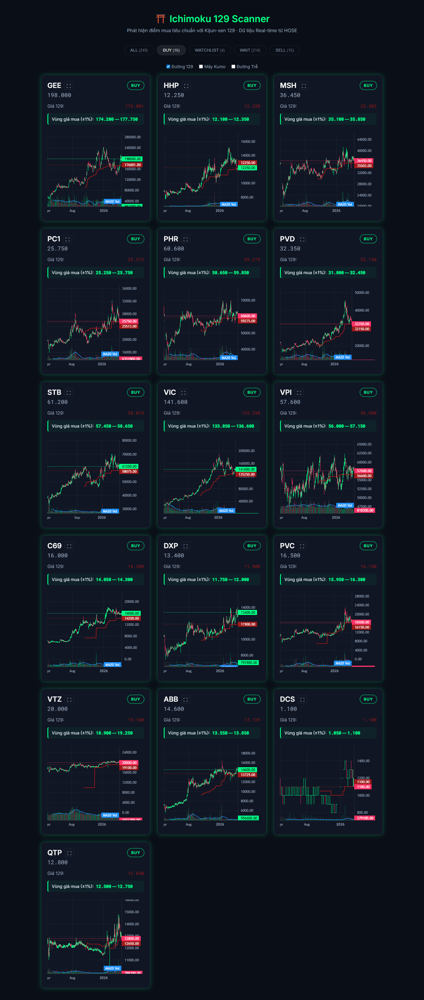
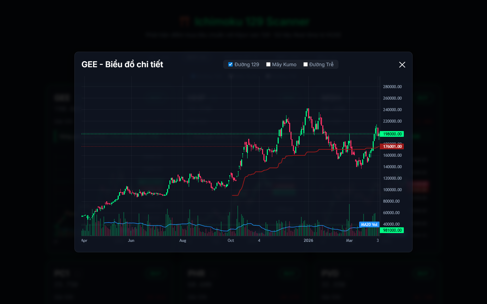

# Ichimoku 129 Scanner Dashboard

Một ứng dụng theo dõi chứng khoán Việt Nam sử dụng giao diện web với Dark Mode Premium. Dashboard tự động quét hơn 250 mã chứng khoán để tìm kiếm và vẽ đồ thị các mã đạt điểm mua đẹp khi giá nằm sát điểm hỗ trợ Kijun-sen chu kỳ 129.

## Tính năng
- **Bảng dữ liệu phân tích tự động:** Lọc và hiển thị các mã đạt điều kiện mua dựa trên khoảng cách với hỗ trợ Kijun 129.
- **Biểu đồ chuyên nghiệp:** Tích hợp đồ thị nến, đường trung bình khối lượng (MA20 Volume), hệ thống mây Ichimoku (Kumo) và đường trễ (Chikou).
- **Bộ lọc tuỳ biến:** Cho phép bật tắt từng đường chỉ báo một cách mượt mà.
- **Phóng to:** Click vào icon góc trên mỗi mã để xem chi tiết biểu đồ to hơn.

## Hình ảnh Mẫu (Screenshots)

**1. Giao diện chính của Dashboard**


**2. Tiện ích phóng to (Modal) biểu đồ chi tiết**


## Cài đặt và sử dụng
```bash
npm install
npm run dev
```
